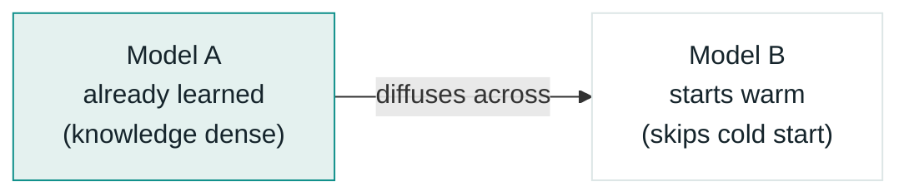
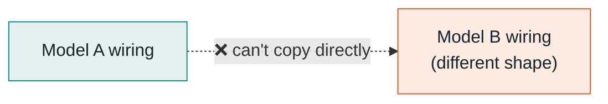
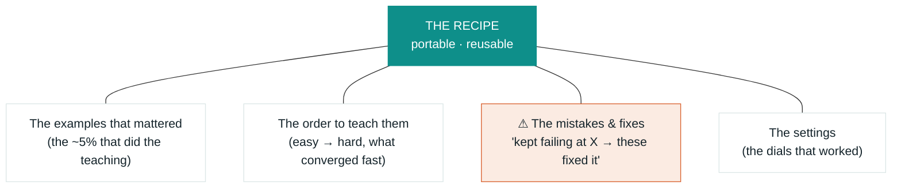

# Osmosis for Models — the idea, explained simply

*Can a model learn from how other models learned? Here's the whole idea in plain language,
with diagrams. There's a nicer illustrated version too — see the artifact link in the repo notes.*

---

## 1. The problem

Every time a new AI model comes out, teaching it a specific skill — say, reviewing legal
contracts — means **starting the teaching over from zero**. Gather examples, run a long training
job, test it, fix mistakes. Next month a better base model drops, and you do it all again.

It's like every new employee rediscovering the job from scratch, even though ten people already
learned it before them. The knowledge exists; it just doesn't carry over. **Nobody kept the
training manual.**

## 2. The idea, in one word: osmosis

In biology, osmosis is when something spreads across a membrane from where there's a lot of it to
where there's little — no pump, it just diffuses. The idea here: let what one model learned
*diffuse* into a new model, so it starts **warm** instead of cold.



## 3. Why not just copy the brain over?

The obvious move — copy Model A's internal wiring straight into Model B — **doesn't work**. Two
models are wired differently inside. A connection that means "be more formal" in one model points
at something unrelated in another. Same reason you can't transplant a memory between two people's
brains: the wiring doesn't line up.



So the transfer has to happen **a level up** — in something both models can read.

## 4. The four things you *can* pass across

If you can't hand over the wiring, what can you hand over? Four things, easiest to deepest:

| # | What transfers | Plain version | Status |
|---|----------------|---------------|--------|
| 1 | **The good examples** | The ~5% of practice problems that actually taught the skill | Solved |
| 2 | **The answers to copy** | Let the trained model grade the new one — learn by imitation (distillation) | Commodity |
| 3 | **The skill patch** | Translate a small "skill add-on" from one model's wiring to another's | Solved '25–'26 |
| 4 | **The recipe** | Not the result — the whole *method* of how it was learned | **Mostly unclaimed** |

Layers 1–3 already have names and papers (distillation, Cross-LoRA, LoRA-X, PorTAL). Racing there
means fighting well-funded labs. **Layer 4 is where the room is.**

## 5. The interesting one: pass the recipe, not the cake

Everyone else ships the finished thing — the trained model, the skill patch. But a great cook
doesn't hand you a cake and call it teaching. They hand you the **recipe**: which ingredients
matter, what order to add them, and the margin notes — *"this step always burns, do it low and slow."*

For a model, the "recipe" bundles four things:



The **mistakes-and-fixes log** (in coral) is the part nobody else carries across. It's what turns
"here's some data" into "here's how to actually learn this."

## 6. The trick that makes it worth it: it compounds

One recipe is nice. The real prize: the recipe **gets better every time a model uses it**. Each
new model adds its own margin notes back, so the second model learns faster than the first, the
third faster than the second. The cost keeps dropping instead of resetting to zero.

```
cost to teach
  ^
  |  ● ─── ● ─── ● ─── ●     ← starting from scratch: never drops
  |   ●
  |     ●─
  |        ●──
  |            ●             ← compounding recipe: cheaper each time
  +----------------------> each new base model, over time
     M1    M2    M3    M4
```

**If that falling line is real — and doesn't flatten after model 2 — the idea is real.** Proving
this one curve is the whole game.

## 7. The honest part

- **What's already taken:** passing a finished *skill patch* between models — the most futuristic-
  sounding part — shipped in 2026 (PorTAL). Big labs publish this as fast as anyone invents it.
- **The sneaky rival:** the simplest baseline — old model grades the new one (distillation) — is
  cheap and shockingly good. Any fancier idea has to *beat that*, or it's over-engineering.
- **The one experiment that decides everything:** do the same practice examples matter for
  *different* models? If yes, compute "which data teaches best" once and reuse it forever. If no,
  most of this falls apart. Small, cheap test — and it should be built first.

Full competitive map, the money question, and candid scores are in
[`strategy.md`](strategy.md) and [`feedback.md`](feedback.md).

---

*The short version: don't ship the cake, ship the recipe — and prove it gets cheaper every time.*
